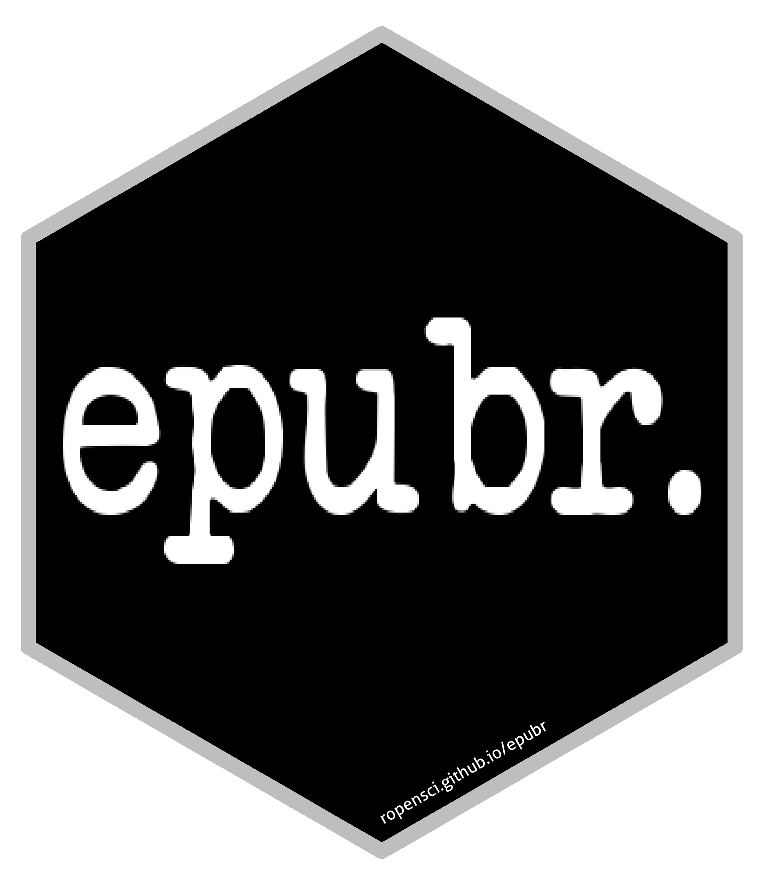

<!-- README.md is generated from README.Rmd. Please edit that file -->

```{r setup, include = FALSE}
knitr::opts_chunk$set(
  collapse = TRUE, comment = "#>", fig.path = "man/figures/README-",
  message = FALSE, warning = FALSE, error = FALSE
)
library(epubr)
```

# epubr 

**Author:** [Matthew Leonawicz](https://github.com/leonawicz/) <a href="https://orcid.org/0000-0001-9452-2771" target="orcid.widget">
<image class="orcid" src="https://members.orcid.org/sites/default/files/vector_iD_icon.svg" height="16"></a>
<br/>
**License:** [MIT](https://opensource.org/licenses/MIT)<br/>

[](http://www.repostatus.org/#active)
[](https://travis-ci.org/ropensci/epubr)
[](https://ci.appveyor.com/project/leonawicz/epubr)
[](https://codecov.io/gh/ropensci/epubr)

[](https://github.com/ropensci/onboarding/issues/222)
[](https://cran.r-project.org/package=epubr)
[](https://cran.r-project.org/package=epubr)
[](https://github.com/ropensci/epubr)

## Read EPUB files in R

Read EPUB text and metadata. 

The `epubr` package provides functions supporting the reading and parsing of internal e-book content from EPUB files. E-book metadata and text content are parsed separately and joined together in a tidy, nested tibble data frame. 

E-book formatting is not completely standardized across all literature. It can be challenging to curate parsed e-book content across an arbitrary collection of e-books perfectly and in completely general form, to yield a singular, consistently formatted output. Many EPUB files do not even contain all the same pieces of information in their respective metadata.

EPUB file parsing functionality in this package is intended for relatively general application to arbitrary EPUB e-books. However, poorly formatted e-books or e-books with highly uncommon formatting may not work with this package.
There may even be cases where an EPUB file has DRM or some other property that makes it impossible to read with `epubr`.

Text is read 'as is' for the most part. The only nominal changes are minor substitutions, for example curly quotes changed to straight quotes. Substantive changes are expected to be performed subsequently by the user as part of their text analysis. Additional text cleaning can be performed at the user's discretion, such as with functions from packages like `tm` or `qdap`.

## Installation

Install `epubr` from CRAN with:

``` r
install.packages("epubr")
```

Install the development version from GitHub with:

``` r
# install.packages("remotes")
remotes::install_github("ropensci/epubr")
```

## Example

Bram Stoker's Dracula novel sourced from Project Gutenberg is a good example of an EPUB file with unfortunate formatting.
The first thing that stands out is the naming convention using `item` followed by some ordered digits does not differentiate sections like the book preamble from the chapters.
The numbering also starts in a weird place. But it is actually worse than this. Notice that sections are not broken into chapters; they can begin and end in the middle of chapters!

These annoyances aside, the metadata and contents can still be read into a convenient table. Text mining analyses can still be performed on the overall book, if not so easily on individual chapters. See the [package vignette](https://docs.ropensci.org/epubr/articles/epubr.html) for examples on how to further improve the structure of an e-book with formatting like this.

```{r ex}
file <- system.file("dracula.epub", package = "epubr")
(x <- epub(file))

x$data[[1]]
```

```{r is_md, echo = FALSE}
is_md <- knitr::opts_knit$get("rmarkdown.pandoc.to") == "markdown_github-ascii_identifiers"
```

```{r md_pkg_ref, echo = FALSE, results = "asis", eval = is_md}
cat('## Reference\n####Documentation\n[Complete package reference and function documentation](https://docs.ropensci.org/epubr)\n\n')
```

## Related packages

[tesseract](https://github.com/ropensci/tesseract) by @jeroen for more direct control of the OCR process.

[pdftools](https://github.com/ropensci/pdftools) for extracting metadata and text from PDF files (therefore more specific to PDF, and without a Java dependency)

[tabulizer](https://github.com/ropensci/tabulizer) by @leeper and @tpaskhalis, Bindings for Tabula PDF Table Extractor Library, to extract tables, therefore not text, from PDF files.

[rtika](https://github.com/ropensci/rtika) by @goodmansasha for more general text parsing.

[gutenbergr](https://github.com/ropenscilabs/gutenbergr) by @dgrtwo for searching and downloading public domain texts from Project Gutenberg.

---

Please note that the `epubr` project is released with a [Contributor Code of Conduct](https://github.com/ropensci/epubr/blob/master/CODE_OF_CONDUCT.md). By contributing to this project, you agree to abide by its terms.

[](https://ropensci.org)
